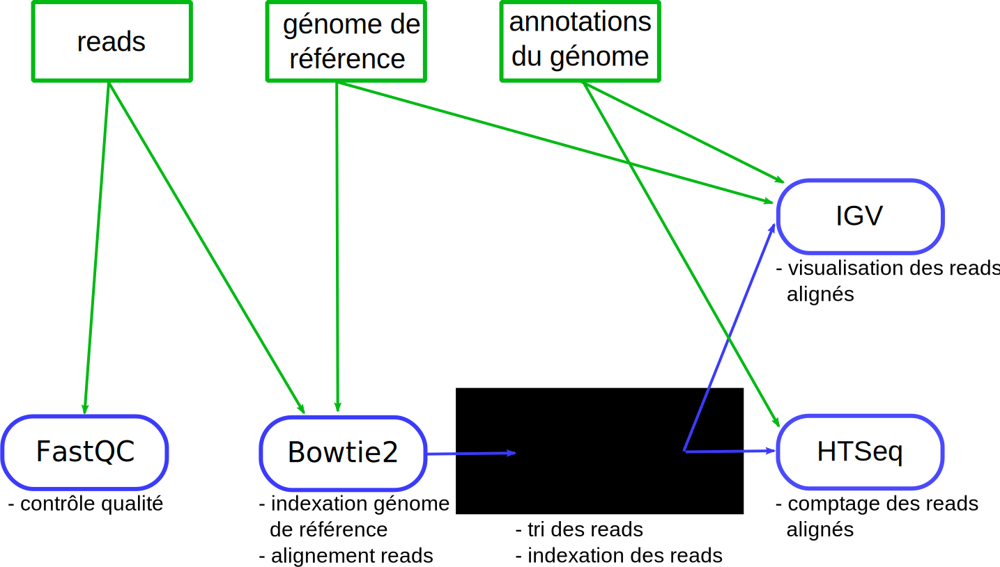

L'objectif de cette partie est d'analyser les données RNA-seq de *O. tauri* sur votre machine Unix locale.

Voici une vue d'ensemble des étapes pour analyser les données de séquençage haut débit :




## 3.1 Préparation de l'environnement de travail

Sous Windows, ouvrez un terminal Ubuntu.

Déplacez-vous dans le répertoire `/mnt/c/Users/omics/rnaseq_sample` :
```
$ cd /mnt/c/Users/omics/rnaseq_sample
```

Activez l'environnement conda *rnaseq* :
```
$ conda activate rnaseq
```

Remarque : contrôlez que le nom de l'environnement conda apparait bien à gauche de l'invite de commande `(rnaseq)`.

Vous êtes maintenant prêt à analyser des données RNA-seq 🤠


## 3.2 Analyse manuelle

Pour cette première analyse, choisissez un **seul échantillon** contenant des *reads*, c'est-à-dire un fichier parmi :
```
reads/HCA-3_R1.fastq.gz
reads/HCA-4_R1.fastq.gz
reads/HCA-5_R1.fastq.gz
reads/HCA-6_R1.fastq.gz
reads/HCA-7_R1.fastq.gz
reads/HCA-8_R1.fastq.gz
```

### Contrôle qualité

Lancez FastQC avec la commande :

```
$ fastqc reads/nom-fichier.fastq.gz
```
où `nom-fichier.fastq.gz` est le fichier contenant l'échantillon que vous avez choisi.

FastQC va produire deux fichiers (un fichier avec l'extension `.html` et un autre avec l'extension `.zip`) dans le répertoire `reads`. Si par exemple, vous avez analysé le fichier `reads/HCA-3_R1.fastq.gz`, vous obtiendrez les fichiers `reads/HCA-3_R1_fastqc.html` et `reads/HCA-3_R1_fastqc.zip`.

En utilisant l'explorateur de fichiers de Windows, ouvrez le fichier `.html` ainsi créé avec Firefox (en cliquant sur le fichier). Analysez le rapport de FastQC.


### Indexation du génome de référence

Toujours depuis votre shell Ubuntu et dans le répertoire `/mnt/c/Users/omics/rnaseq_sample`, créez le répertoire `index` :

```
$ mkdir -p index
```

Lancez l'indexation du génome de référence.
```
$ bowtie2-build genome/GCF_000214015.3_version_140606.fna index/O_tauri
```
Les index sont stockés dans des fichiers dont le nom débute par `O_tauri` dans le répertoire `index`.

Calculez la taille total des fichiers index avec la commande :
```
$ du -ch index/O_tauri*
```

Comparez la taille totale des index à la taille du fichier contenant le genome (`genome/GCF_000214015.3_version_140606.fna`).

L'indexation du génome n'est à faire qu'une seule fois.


### Alignements des *reads* sur le génome de référence

Créez le répertoire `map` qui va contenir les *reads* alignés sur le génome de référence :
```
$ mkdir -p map
```

Lancez l'alignement :
```
$ bowtie2 -p 2 -x index/O_tauri -U reads/nom-fichier.fastq.gz -S map/bowtie.sam
```

Ici :
- `genome/O_tauri` désigne les fichiers index du génome de référence,
- `reads/nom-fichier.fastq.gz` est le fichier contenant l'échantillon que vous avez choisi
- et `reads/bowtie.sam` est le fichier qui va contenir l'alignement produit par Bowtie2.

Comme votre machine dispose de 4 coeurs, nous en utilisons 2 (`-p 2`) pour accélérer le calcul.

Cette étape peut prendre plusieurs minutes. **Bowtie n'affiche rien à l'écran lorsqu'il fonctionne**. Soyez patient.

À la fin de l'alignement, Bowtie2 renvoie des informations qui ressemblent à :

```
6757072 reads; of these:
  6757072 (100.00%) were unpaired; of these:
    1129248 (16.71%) aligned 0 times
    5164196 (76.43%) aligned exactly 1 time
    463628 (6.86%) aligned >1 times
83.29% overall alignment rate
```
On obtient ainsi :
- le nombre total de *reads* lus dans le fichier `.fastq.gz` (ici `6757072`)
- le nombre de *reads* non alignés « *aligned 0 times* » (`1129248`, soit `16.71%` du nombre total de *reads*)
- le nombre de *reads* alignés une seule fois (`5164196`)
- le nombre de *reads* alignés plus d'une fois (`463628`)
- un taux d'alignement global (`83.29%`)

Il faut être prudent si le nombre de *reads* non alignés est trop important (> 20%).


### Conversion des *reads* alignés en binaire, tri et indexation

Vous allez maintenant utiliser SAMtools pour :

1. Convertir le fichier `.sam` (fichier texte) créé par Bowtie2 en fichier `.bam`, qui est un fichier binaire, et qui donc prend moins de place sur le disque.
    ```
    $ samtools view -@ 2 -b map/bowtie.sam > map/bowtie.bam
    ```
    Cette étape va prendre plusieurs minutes.  
    Comparez la taille deux fichiers `map/bowtie.sam` et `map/bowtie.bam`. Quel est le ratio de compression entre les deux formats de fichiers ?

2. Trier les *reads* alignés suivant l'ordre dans lequel ils apparaissent dans le génome.
    ```
    $ samtools sort -@ 2 map/bowtie.bam -o map/bowtie.sorted.bam
    ```
    Cette étape peut prendre une dizaine de minutes.

3. Indexer le fichier `.bam`. Cette étape est indispensable pour visualiser l'alignement avec IGV.
    ```
    $ samtools index map/bowtie.sorted.bam
    ```


### Comptage des *reads* alignés sur les gènes de *O. tauri*

Le comptage des *reads* alignés sur les gènes se fait avec HTSeq.

Toujours depuis votre shell Ubuntu et dans le répertoire `/mnt/c/Users/omics/rnaseq_sample`, créez le répertoire `count` :
```
$ mkdir -p count
```

Puis lancez la commande (en une seule ligne) pour compter les *reads* alignés :
```
$ htseq-count --stranded=no --type='gene' --idattr='ID' --order=name --format=bam map/bowtie.sorted.bam genome/GCF_000214015.3_version_140606.gff > count/count.txt
```

HTSeq renvoie le nombre d'annotations trouvées dans le fichier `.gff` puis affiche une progression de l'analyse. Les options du programme `htseq-count` sont décrites dans la [documentation](http://gensoft.pasteur.fr/docs/HTSeq/0.9.1/count.html).

Déterminez le nombre de *reads* alignés sur le gène `ostta18g01980`. Pour cela, lancez la commande :
```
$ grep ostta18g01980 count/count.txt
```
ou alors ouvrir le fichier `count/count.txt` avec la commande `less` puis chercher le gène `ostta18g01980` en tapant `/ostta18g01980` puis la touche <kbd>Entrée</kbd>.


### Visualisation des *reads* alignés avec IGV

Pour visualiser l'alignement des *reads* sur le génome de référence avec IGV, vous avez besoin des fichiers suivants :
- Le génome de référence (`genome/GCF_000214015.3_version_140606.fna`).
- Les annotations du génome de référence (`genome/GCF_000214015.3_version_140606.gff`).
- Le fichier bam trié (`map/bowtie.sorted.bam`).
- L'index du bam trié (`map/bowtie.sorted.bam.bai`).

Lancez IGV et visualisez l'alignement des *reads* sur le génome de référence. Si vous avez oublié comme faire, visionnez la vidéo sur ce sujet qui vous a été proposée précédemment.

Visualisez particulièrement le gène `ostta18g01980`.


## 3.3 Automatisation de l'analyse : niveau 1

Tout cela est très bien mais les fichiers que vous avez générés (`map/bowtie.bam`, `map/bowtie.sorted.bam`, `cout/count.txt`...) portent des noms qui ne sont pas très informatifs sur l'échantillon dont ils proviennent.

Par ailleurs, entrer toutes ces commandes à la main, les unes après les autres, est pénible et source d'erreurs. Et il y a fort à parier que vous aurez complètement oublié ces commandes dans 1 semaine, voire dans 1 heure. C'est parfaitement normal, il n'y a absolument aucun intérêt à se souvenir de toutes ces commandes.

Pour répondre à ces deux problèmes, de gestion de données et d'automatisation, nous allons introduire les notions Bash de variables et de scripts.


### Variables

Une variable va simplement contenir de l'information qui sera utilisable autant de fois que nécessaire.

Création de variables :
```
$ toto=33
$ t="salut"
```
Il faut coller le nom de la variable et son contenu au symbole `=`.

Affichage de variables :
```
$ echo $toto
33
$ echo "$t Pierre"
salut Pierre
```
La commande `echo` affiche une chaîne de caractère, une variable, ou les deux.

Pour utiliser une variable (et accéder à son contenu), il faut précéder son nom du caractère `$`. Attention, ce symbole n'est pas à confondre avec celui qui désigne l'invite de commande de votre *shell* Linux.

Enfin, une bonne pratique consiste à utiliser une variable avec le symbole `$` et son nom entre accolades :
```
$ echo ${toto}
33
$ echo "${t} Pierre"
salut Pierre
```

### Script

Un script est un fichier texte qui contient des instructions Bash. Par convention, il porte l'extension `.sh`.

Dans un script Bash, tout ce qui suit le symbole `#` est considéré comme un commentaire et n'est donc pas traité par Bash.


### Analyse RNA-seq

Observez le script bash [script1.sh](script1.sh) et essayer de comprendre son fonctionnement, notamment l'utilisation des variables.

Testez le script `script1.sh` sur **un seul** de vos échantillons. Pour cela :

- Recopiez le script dans un fichier `script1.sh` dans votre répertoire `rnaseq_sample` ou, plus simplement, téléchargez-le directement avec la commande
    ```
    $ wget https://raw.githubusercontent.com/omics-school/analyse-rna-seq/master/script1.sh
    ```

- Ouvrez le script `script1.sh` avec `nano` et modifiez la variable `sample` avec votre numéro d'échantillon. Sauvegardez le script (`ctrl + o`) et quittez nano (`ctrl + x`).  
    Rappel : pas d'espace avant ou après le symbole `=` !

- Lancez le script avec la commande
    ```
    $ bash script1.sh
    ```

Vérifiez que le déroulement du script se passe bien. Vous avez le temps de prendre un café ☕. Voir plusieurs ☕ 🍪 ☕ 🍪.


## 3.4 Automatisation de l'analyse : niveau 2

Le script précédent était pratique mais il ne conserve pas les informations liées à l'alignement (nombre de *reads* non-alignés, alignés une fois...).

Le [script 2](script2.sh) répond à ce problème. Pour le télécharger, utilisez la commande :
```
$ wget https://raw.githubusercontent.com/omics-school/analyse-rna-seq/master/script2.sh
```
Vous remarquerez que la solution proposée pour conserver les informations liées à l'alignement est un peu particulière. Nous allons en discuter, mais dans un premier temps essayer de comprendre l'explication donnée [ici](https://stackoverflow.com/questions/876239/how-can-i-redirect-and-append-both-stdout-and-stderr-to-a-file-with-bash).


## 3.5 Automatisation de l'analyse : niveau 3 (ninja)

Le script précédent était intéressant mais il ne prend en compte qu'un seul échantillon à la fois. Quel ennui !

On aimerait avoir un seul script qui traiterait tous les échantillons qu'on souhaite analyser.
Cela est possible avec une boucle. Une boucle permet de répéter un ensemble d'instructions.

Voici un exemple en Bash :
```
$ for prenom in gaelle bertrand pierre
> do
> echo "Salut ${prenom} !"
> done
Salut gaelle !
Salut bertrand !
Salut pierre !
```
En sacrifiant un peu de lisibilité, la même commande peut s'écrire sur une seule ligne :
```
$ for prenom in gaelle bertrand pierre; do echo "Salut ${prenom} !"; done
Salut gaelle !
Salut bertrand !
Salut pierre !
```

Notez l'utilisation du symbole `;` pour séparer les différents éléments de la boucle.

Une leçon de Software Carpentry aborde la notion de [boucle](https://swcarpentry.github.io/shell-novice/05-loop/index.html). Prenez quelques minutes pour la parcourir et faire les exercices.

Le [script 3](script3.sh) utilise une boucle. Observez la structure du script et essayez de comprendre son fonctionnement.

La ligne `set -euo pipefail` tout au début du script va arrêter celui-ci :
- à la première erreur ;
- si une variable n'est pas définie ;
- si une erreur est rencontrée dans une commande avec un pipe (`|`).

C'est une mesure de sécurité importante pour votre script. Si vous le souhaitez, vous pouvez lire l'article de Aaron Maxwell à ce sujet : [Use the Unofficial Bash Strict Mode (Unless You Looove Debugging)](http://redsymbol.net/articles/unofficial-bash-strict-mode/)

Téléchargez le script 3 avec la commande :
```
$ wget https://raw.githubusercontent.com/omics-school/analyse-rna-seq/master/script3.sh
```

Modifiez le script 3 avec les numéros d'échantillons que vous avez à analyser. Faites bien attention à la variable concernée et sa syntaxe.

Si vous pensez en avoir le temps, lancez le script 3. Comme ce script va automatiser toute l'analyse, il va fonctionner plusieurs dizaines de minutes et vous aurez peut-être besoin de fermez votre terminal. Pour ne pas arrêter brutalement l'analyse, lancez le script de cette manière :

```
$ nohup bash script3.sh &
```
Mais pour autant, n'éteignez pas votre ordinateur !


Le message 
```
nohup: ignoring input and appending output to 'nohup.out'
```
vous rappelle que les messages qui apparaissaient habituellement à l'écran seront redirigés dans le fichier `nohup.out`.


##  3.6 Comparaison avec les logiciels utilisés dans Galaxy (si vous avez du temps)

Connectez-vous maintenant à votre compte sur Galaxy. Essayez de retrouver les versions des logiciels que vous utilisés (FastQC, Bowtie2, SAMtools, HTSeq).

Pour ce faire, dans votre *History*, cliquez sur le nom d'un résultat d'analyse, puis cliquez sur le petit i entouré (:information_source:) et lisez les informations de la section *Job Dependencies*.

Comparez les versions des logiciels disponibles dans Galaxy et de ceux que vous avez utilisé sur votre machine.
