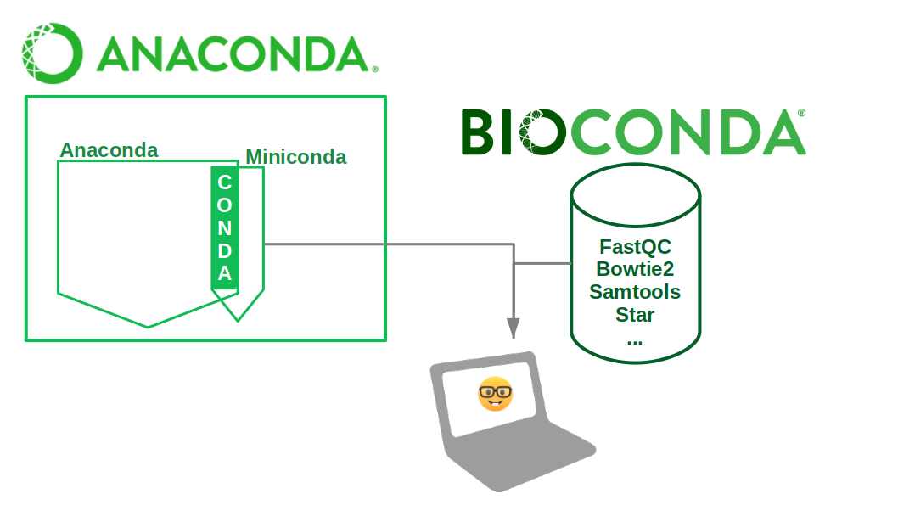

class: center, middle

# Analyse de données RNA-seq avec Unix

## DU Omiques 2019

Pierre Poulain / @pierrepo

      

 </img>

 </img>

.footer[
Ce contenu est mis à disposition selon les termes de la licence Creative Commons BY-SA 4.0
]

---

layout: true
name: title
class: center, middle
.footer[
DU Omiques 2019
]

---

layout: true
name: contentleft
class: top, left
.footer[
DU Omiques 2019
]

---

layout: true
name: contentcenter
class: top, center
.footer[
DU Omiques 2019
]

---

template: contentleft

# Objectifs de l'activité

--

- Décrire et expliquer un processus d'analyse RNA-seq sous Unix.

- Utiliser un environnement conda.

- Modifier et lancez un script *shell* pour automatiser un processus d'analyse.

- Copier des données entre le serveur et votre ordinateur.

---
template: contentleft

# Le processus d'analyse RNA-seq

.center[

]

---
template: contentleft

# Conda 🐍

.center[

]

---
template: contentleft

# Copie de données 🦄

--

## [FileZilla](https://filezilla-project.org/)

.center[

]

Hôte : `sftp://omics-school.net`

--

## `scp` (à utiliser depuis la machine locale)

De la machine locale vers le serveur : `$ scp fichier.txt ppoulain@omics-school.net:~/repertoire/`

Du serveur vers la machine locale : `$ scp ppoulain@omics-school.net:~/repertoire/fichier.txt ./`

---

template: contentleft

background-color: #cccccc

# C'est parti ! 🚀

## 💻 [Tutoriel](https://omics-school.github.io/analyse-rna-seq/analyse_RNA-seq_O_tauri.html)

## 💻 [Check-list](https://omics-school.github.io/analyse-rna-seq/analyse_RNA-seq_O_tauri_check-list.html)
