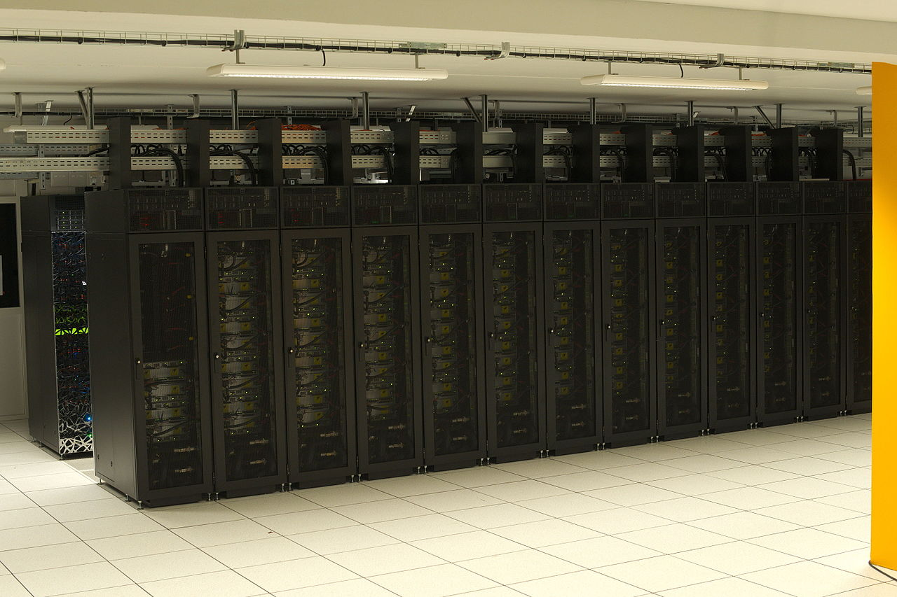
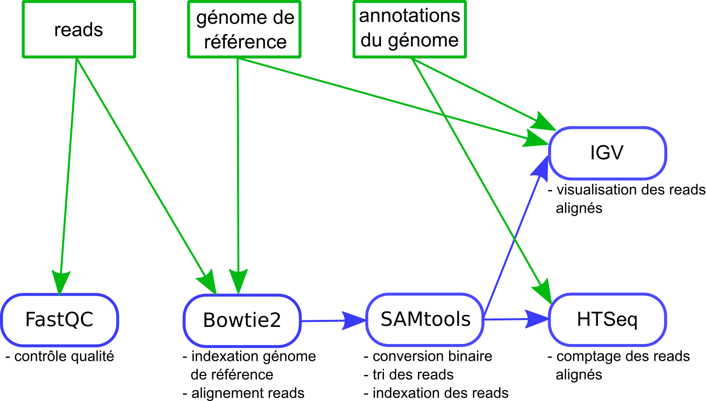

class: center, middle

# Analyse de données RNA-seq avec un cluster SLURM

## DU Omiques 2019

Pierre Poulain / @pierrepo

<br /><br /><br /><br /><br /><br />

<div>

 </img>
<div style="display: inline-block; width:100px;"></div>

 </img>
</div>

.footer[
Ce contenu est mis à disposition selon les termes de la licence Creative Commons BY-SA 4.0
]

---

layout: true
name: title
class: center, middle
.footer[
DU Omiques 2019
]

---

layout: true
name: contentleft
class: top, left
.footer[
DU Omiques 2019
]

---

layout: true
name: contentcenter
class: top, center
.footer[
DU Omiques 2019
]

---

template: contentleft

# Objectifs de l'activité

--

- Expliquer le fonctionnement du cluster de l'IFB.

- Utiliser les commandes SLURM.

- Adapter un processus d'analyse RNA-seq pour un cluster.

- Lancez un script *sbatch* pour automatiser un processus d'analyse.

- Copier des données entre le serveur et votre ordinateur.


---
template: contentleft

# Dessine-moi un cluster...

--

.center[

]

.footnote[
	Jade / CINES<br />
	.ref[Source : <a href="https://commons.wikimedia.org/wiki/File:Jade_CINES.jpg">Penalva</a>, Wikipedia, CC BY-SA]
]

---
template: contentleft

# Dessine-moi un cluster...

.center[

]

.footnote[
	Occigen / CINES<br />
	.ref[Source : <a href="https://commons.wikimedia.org/wiki/File:Occigen.jpg">Penalva</a>, Wikipedia, CC BY-SA]
]

---
template: contentleft

# Dessine-moi un cluster...

.center[

]

.footnote[
	Cluster NNCR / IFB<br />
	.ref[Source : Julien Seiler, IFB, CC BY-SA]
]

---
template: contentleft

# Un noeud

.center[

]

Un noeud (*node*) = une machine physique = un élément du cluster

Sur ce cluster, un noeud a deux processeurs. Un processeur a 14 coeurs hyperthreadés.

.footnote[.ref[
	Source : Julien Seiler, IFB, CC BY-SA
]]


---
template: contentleft

# Some HPC clusters in France

.pure-table.pure-table-bordered.smaller-font[
Cluster | Data center location | Cores | RAM (GB) | Storage (TB) | Access modality
--- | --- | --- | --- | --- | ---
IFB Core | IDRIS - Orsay | 2 000 | 20 008 | 400 | Open to all academic biologists and bioinformaticians
GENOTOUL | Toulouse | 3 064 | 34 304 | 3 000 | Open to all academics with priority to INRA/Occitane region (currently overloaded)
CINES OCCIGEN | Montpellier | 85&nbsp;824 | 202&nbsp;000 | 8 000 | Periodic calls for projects (~2 calls / year)
]

.footnote[.ref[
	Source : Julien Seiler, IFB, CC BY-SA
]]

---
template: contentleft

# Schéma du cluster NNCR IFB

NNCR = *National Network of Computational Resources*

.center[

]

.footnote[.ref[
	Source : Julien Seiler, IFB, CC BY-SA
]]

---
template: contentleft

# Organisation

Noeud de connexion

```
$ ssh login@core.cluster.france-bioinformatique.fr
```

--
<br />
<br />

On ne lance pas d'analyse **SUR** ce noeud 😡 
mais on lance un job **DEPUIS** ce noeud 😇.

Noeud de connexion = noeud de soumission

Utilisation des commandes SLURM (`srun`, `sbatch`, `squeue`...)

--
<br />
<br />
<br />

`/shared/home/login` : répertoire utilisateur. Espace très limité. On ne fait rien ici.

`/shared/projects/du_o_2019/login` : répertoire de stockage. Contient toutes vos données d'analyse.

`/shared/projects/du_o_2019/data` : répertoire de données partagées. En lecture seulement.

---
template: contentleft

# SLURM ?

*Simple Linux Utility for Resource Management*

--

.center[

]

.center[
## Donne accès à la puissance de calcul du cluster.
]

---
template: contentleft

# srun

```
$ srun ma_commande
```

Exécute `ma_commande` sur un des noeuds du cluster (1 seul noeud, 1 seul coeur).


<br />
Interactif. Un job à la fois. 

--

<br />
Sauf si :
```
$ nohup srun ma_commande & 
```

---
template: contentleft

# squeue

```
$ squeue
$ squeue -u login
```

Affiche les jobs dans la queue (en attente et en exécution).

--

# scancel 

```
$ scancel job-id
$ scancel -u login
```

---
template: contentleft

# sbatch 

```
$ sbatch my-script.sh
```

--
<hr />

my-script.sh :
```
#!/bin/bash

#SBATCH -n 1
#SBATCH --partition=fast
#SBATCH --mail-user=pierre.poulain@univ-paris-diderot.fr
#SBATCH --mail-type=ALL

srun echo "Hello world!"
srun hostname
srun echo "Memory size: $(free -h | awk '/Mem/ {print $2}')"
srun sleep 30
srun echo "Bye bye"

wait
```

---
template: contentleft

# sbatch 


```
$ sbatch my-script.sh 
Submitted batch job 446182

$ cat slurm-446182.out 
Hello world!
cpu-node-6
Memory size: 251G

```


---
template: contentleft

# sbatch 

Sur le cluster NNCR.

Job d'une journée max :
```
#SBATCH --partition=fast
```

Job de 10 jours max :
```
#SBATCH --partition=long
```


---
template: contentleft

# sacct

Des stats...

```
$ sacct --format=User,JobID,Jobname,partition,state,start,elapsed,nnodes,ncpus,nodelist
```
Affiche l'identifiant et le nom du job, le type de queue, l'état du job, le début, le temps consommé, le nombre de noeuds, le nombre de coeurs et les noms des coeurs.


--
<br />

# sreport 

```
$ sreport Cluster UserUtilizationByAccount Start=2019-01-01 Users=login
```
Temps de calcul total consommé (en minutes). Important pour des appels d'offre !


---
template: contentleft

# Environnements logiciels

```
$ module load du_o/2019
```

--
<br />
<br />

Liste des modules disponibles :
```
$ module avail 
$ module avail -l | grep fastqc
```

Liste des modules chargés :
```
$ module list
```

Décharger un module :
```
$ module unload un-module
```

<br />
<div style="background-color:lightblue; fontsize:1.2rem; padding: 10px;">
Toujours activer le(s) module(s) nécessaire(s) <strong>avant</strong> de lancer une analyse avec <tt>srun</tt> ou <tt>sbatch</tt>.
</div>

---
template: contentleft

# Doc et liens utiles

[IFB Core Cluster documentation](http://taskforce-nncr.gitlab.cluster.france-bioinformatique.fr/doc/)


[IFB Cluster Community Support](https://community.cluster.france-bioinformatique.fr)

Webinar 06/06/2019 11h-12h !


---
template: contentleft

# Le processus d'analyse RNA-seq

.center[

]


---

template: contentleft

background-color: #cccccc

# À vous ! 🚀

## 💻 [Tutoriel](https://omics-school.github.io/analyse-rna-seq/cluster_IFB)

.center[

]